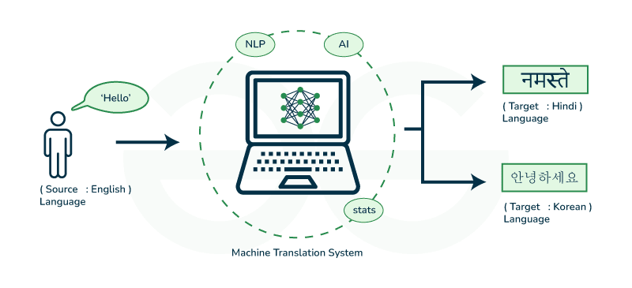

# Natural Language Processing with Classification and Vector Spaces

## Project: Naive Machine Translation and Locality Sensitive Hashing (LSH)

This project was the last section of the NLP specialization with classification and vector spaces authorized by DeepLearning.AI and offered through Coursera. I implemented and developed a machine translation system to translate English words to French using word embeddings and vector space models. The project involved the following key steps:

1. **Generating Embedding and Transformation Matrices**:
   - Created matrices for English and French word embeddings using a provided dictionary.
   - Ensured that each row in the English matrix corresponded to the same row in the French matrix for accurate alignment.

2. **Translation as Linear Transformation**:
   - Implemented a linear transformation to convert English word embeddings to French embeddings.
   - Minimized the translation error by computing and optimizing a transformation matrix using the Frobenius norm loss function.

3. **Testing the Translation**:
   - Evaluated the translation system by finding the nearest neighbors in the French embeddings and recommending the most similar French word.
   - Managed to translate words from one language to another language without ever seeing them with almost `56% accuracy` by using some basic linear algebra and    learning a mapping of words from one language to another!

4. **Locality Sensitive Hashing (LSH) for Document Search**:
   - Applied LSH to perform efficient document search and find similar tweets.
   - Created hash tables to index document embeddings, enabling fast approximate nearest neighbor search.

This project enhanced my understanding of machine translation techniques and the practical application of word embeddings in natural language processing tasks.
