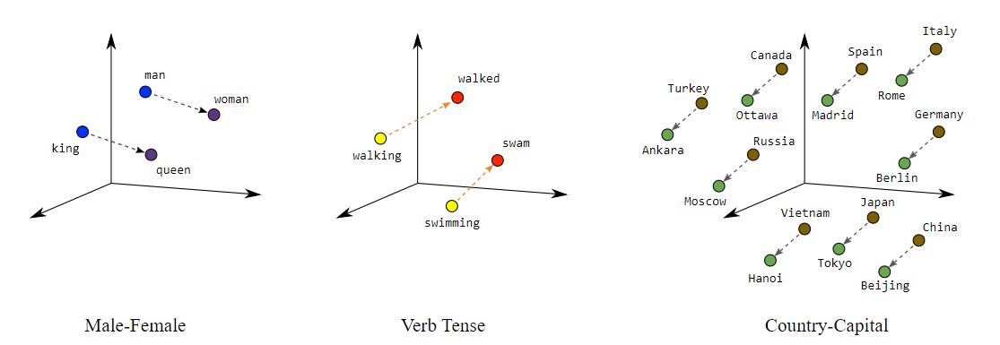

# Natural-Language-Processing-with-Classification-and-Vector-Spaces

Welcome to my Natural Language Processing (NLP) Specialization repository, comprising four comprehensive courses designed to enhance anyone's skills in NLP. In this specialization, I gained hands-on experience in **performing sentiment analysis on tweets using logistic regression and naïve Bayes**, **vector space models to uncover word relationships and apply PCA for dimensionality reduction and visualization**, and **implementing a basic English-to-French translation algorithm using pre-computed word embeddings and locality-sensitive hashing for approximate k-nearest neighbor search**.

 

## About the Course and Instructors:

This NLP specialization is authorized by **DeepLearning.AI and offered through Coursera**. It is crafted and instructed by renowned experts in NLP, machine learning, and deep learning:

- **Younes Bensouda Mourri**: AI Instructor at Stanford University, co-creator of the Deep Learning Specialization.
- **Łukasz Kaiser**: Staff Research Scientist at Google Brain, co-author of TensorFlow, and contributor to Tensor2Tensor, Trax libraries, and the Transformer paper.
