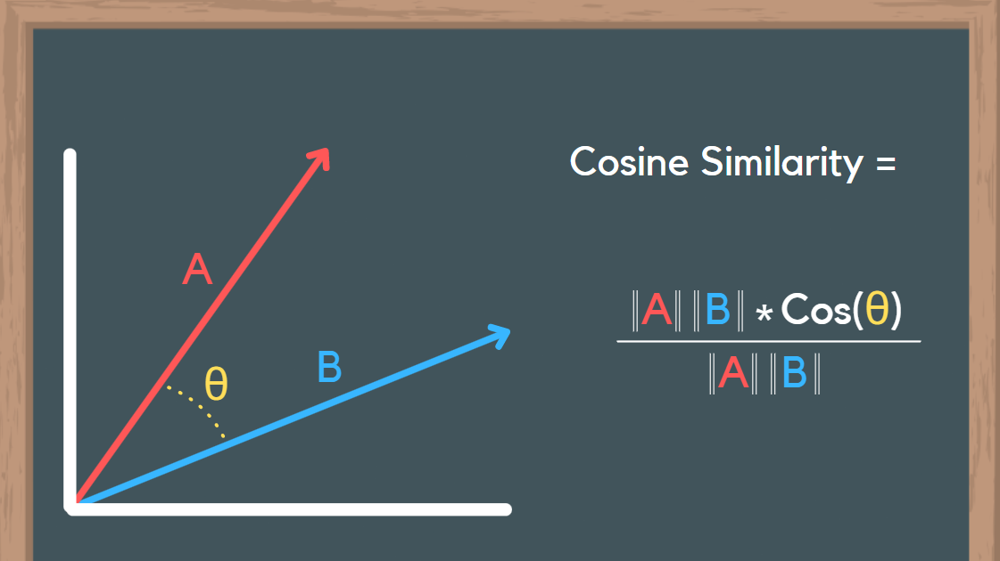

This project was the third section of the **NLP specialization with classification and vector spaces** authorized by DeepLearning.AI and offered through Coursera. The main goal is to explore word vectors in natural language processing (NLP). Word vectors represent each word as a vector of numbers, encoding the meaning of the word. This project includes various parts to understand and use word vectors.

 

## Predict the Countries from Capitals
In this part of the project, I predict the countries that correspond to some capitals using NLP. The exercises included in this part are:

### Importing the Data
I start by importing essential Python libraries and loading the dataset as a Pandas DataFrame.

### Cosine Similarity
I implement a function `cosine_similarity` that takes in two word vectors and computes the cosine distance between them. Using the word embeddings, I predict the relationships among words to find the country given its capital. Then I evaluate the accuracy of our model in predicting the correct countries from given capitals.

### Plotting the Vectors using PCA

I also use Principal Component Analysis (PCA) to reduce the dimensionality of the word embeddings and plot them in two dimensions.

